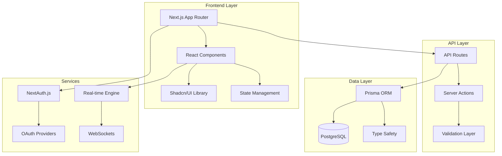

# 🚀 SponsorFlow - Professional YouTube Sponsorship Management Platform

<div align="center">
  
  
  <h3>Transform Your YouTube Sponsorship Chaos Into Organized Success</h3>
  
  <p>
    <strong>Built by creators, for creators</strong> • Manage sponsorships like a pro with our enterprise-grade Kanban workflow
  </p>
  
  <p>
    <a href="https://sponsorflow-demo.vercel.app"></a>
    <a href="#-quick-start"></a>
    <a href="#-features"></a>
  </p>
  
  <p>
    
    
    
  </p>
</div>

---

## 🎬 See It In Action

<div align="center">
  
</div>

---

## 🌟 Why SponsorFlow?

Are you tired of:
- 📊 **Messy spreadsheets** that become unmanageable?
- 🤯 **Lost sponsorship opportunities** due to poor tracking?
- 📧 **Endless email chains** with no clear status?
- 💸 **Missing payments** because you forgot to follow up?
- 📅 **Deadline stress** from lack of visibility?

**SponsorFlow is your solution!** Built with modern web technologies and designed specifically for YouTube creators, it transforms how you manage sponsorships.

---

## ✨ Features That Creators Love

### 🎯 **9-Stage Sponsorship Workflow**
Track deals from initial contact to payment completion with our creator-optimized stages:

<table>
<tr>
<td width="33%">

**📥 Lead Management**
- New Leads
- Initial Contact
- Negotiation

</td>
<td width="33%">

**📝 Production Flow**
- Contract Review  
- Content Creation
- Review & Approval

</td>
<td width="33%">

**💰 Completion**
- Publishing
- Payment Pending
- Completed

</td>
</tr>
</table>

### 🚀 **Powerful Features**

<details>
<summary><b>🎨 Beautiful Kanban Board</b> - Click to expand</summary>

- **Drag & Drop** deals between stages with smooth animations
- **Real-time Updates** - See changes as they happen
- **Priority Indicators** - Never miss urgent deals
- **Quick Actions** - Edit, archive, or delete without leaving the board
- **Custom Views** - Board, List, or Calendar view

</details>

<details>
<summary><b>📊 Advanced Analytics Dashboard</b> - Click to expand</summary>

- **Revenue Tracking** - Monitor earnings over time
- **Performance Metrics** - Win rate, average deal value, cycle time
- **Sponsor Leaderboard** - Identify your top partnerships
- **Pipeline Health** - Spot bottlenecks in your workflow
- **Custom Reports** - Export data for deeper analysis

</details>

<details>
<summary><b>🔔 Smart Notifications</b> - Click to expand</summary>

- **Real-time Alerts** - Never miss important updates
- **Deadline Reminders** - Stay on top of due dates
- **Stage Change Notifications** - Know when deals progress
- **Email Integration** - Get notified via email
- **Browser Notifications** - Desktop alerts for urgent items

</details>

<details>
<summary><b>🤝 Collaboration Tools</b> - Click to expand</summary>

- **Team Management** - Assign deals to team members
- **Comments & Mentions** - Discuss deals with @mentions
- **Activity Timeline** - See complete deal history
- **File Attachments** - Keep contracts and briefs organized
- **Role-Based Access** - Control who sees what

</details>

<details>
<summary><b>🔐 Enterprise Security</b> - Click to expand</summary>

- **OAuth Authentication** - Login with Google/GitHub
- **Row Level Security** - Data isolation per user
- **Audit Logging** - Track all changes
- **SSL Encryption** - Secure data transmission
- **GDPR Compliant** - Privacy-first design

</details>

---

## 🛠️ Built With Best-in-Class Technology

<table>
<tr>
<td align="center" width="25%">

<br><b>Next.js 14</b>
<br><sub>React Framework</sub>
</td>
<td align="center" width="25%">

<br><b>TypeScript</b>
<br><sub>Type Safety</sub>
</td>
<td align="center" width="25%">

<br><b>PostgreSQL</b>
<br><sub>Database</sub>
</td>
<td align="center" width="25%">

<br><b>Tailwind CSS</b>
<br><sub>Styling</sub>
</td>
</tr>
</table>

**🔧 Complete Tech Stack:**
- **Frontend**: Next.js 14, React 18, TypeScript, Tailwind CSS
- **UI Components**: Shadcn/UI, Radix UI, Framer Motion
- **Backend**: Next.js API Routes, Prisma ORM, PostgreSQL
- **Authentication**: NextAuth.js v5 (OAuth + JWT)
- **Real-time**: WebSockets, Server-Sent Events
- **State Management**: Zustand, React Query
- **Testing**: Jest, React Testing Library, Playwright
- **Deployment**: Vercel, Docker, GitHub Actions

---

## 🚀 Quick Start

Get SponsorFlow running in **under 5 minutes**:

### Prerequisites
- Node.js 18+ and npm/yarn/pnpm
- PostgreSQL database (local or cloud)
- Google OAuth credentials (for authentication)

### 1️⃣ Clone & Install

```bash
# Clone the repository
git clone https://github.com/nordeim/Kanban-Board-SponsorFlow.git sponsorflow
cd sponsorflow

# Install dependencies
npm install
```

### 2️⃣ Configure Environment

```bash
# Copy environment template
cp .env.example .env.local

# Edit .env.local with your settings:
# - DATABASE_URL (PostgreSQL connection string)
# - NEXTAUTH_SECRET (generate with: openssl rand -base64 32)
# - Google OAuth credentials
```

### 3️⃣ Setup Database

```bash
# Generate Prisma client
npx prisma generate

# Run migrations
npx prisma migrate dev

# Seed with demo data
npm run db:seed
```

### 4️⃣ Launch! 🎉

```bash
# Start development server
npm run dev

# Open http://localhost:3000
# Login with: demo@sponsorflow.io / demo123
```

---

## 📖 Comprehensive Documentation

### 🏗️ Architecture Overview



### 📁 Project Structure

```
sponsorflow/
├── 📱 src/app/              # Next.js 14 App Router
│   ├── (auth)/             # Authentication pages
│   ├── (dashboard)/        # Protected dashboard
│   └── api/                # API endpoints
├── 🎨 src/components/       # React components
│   ├── ui/                 # Shadcn/UI components
│   ├── board/              # Kanban board
│   └── analytics/          # Charts & metrics
├── 🧩 src/lib/             # Core utilities
│   ├── auth/               # Authentication
│   ├── db/                 # Database client
│   └── hooks/              # Custom hooks
├── 🗄️ prisma/              # Database schema
├── 🧪 tests/               # Test suites
└── 📋 docs/                # Documentation
```

### 🔑 Key Features Implementation

<details>
<summary><b>Authentication Flow</b></summary>

```typescript
// Secure authentication with NextAuth.js
import { auth } from '@/lib/auth/auth'

export async function getServerSession() {
  const session = await auth()
  if (!session) redirect('/login')
  return session
}
```

</details>

<details>
<summary><b>Real-time Updates</b></summary>

```typescript
// WebSocket integration for live updates
const { isConnected, emit } = useRealtimeDeals(userId)

// Automatic UI updates when deals change
socket.on('deal:updated', (deal) => {
  queryClient.invalidateQueries(['deals'])
})
```

</details>

<details>
<summary><b>Drag & Drop System</b></summary>

```typescript
// Smooth drag and drop with @dnd-kit
<DndContext onDragEnd={handleDragEnd}>
  <SortableContext items={deals}>
    {deals.map(deal => (
      <DealCard key={deal.id} deal={deal} />
    ))}
  </SortableContext>
</DndContext>
```

</details>

---

## 🧪 Testing & Quality

We maintain **high code quality** standards:

```bash
# Run all tests
npm run test          # Unit tests with Jest
npm run e2e           # E2E tests with Playwright
npm run type-check    # TypeScript validation
npm run lint          # ESLint checks
```

**Coverage Targets:**
- ✅ Unit Test Coverage: >80%
- ✅ E2E Critical Paths: 100%
- ✅ TypeScript Strict Mode
- ✅ Accessibility (WCAG 2.1 AA)

---

## 🚢 Deployment

### Deploy to Vercel (Recommended)

[](https://vercel.com/new/clone?repository-url=https%3A%2F%2Fgithub.com%2Fnordeim%2FKanban-Board-Application&env=DATABASE_URL,NEXTAUTH_SECRET,NEXTAUTH_URL,GOOGLE_CLIENT_ID,GOOGLE_CLIENT_SECRET&envDescription=Required%20environment%20variables&envLink=https%3A%2F%2Fgithub.com%2Fnordeim%2FKanban-Board-Application%23environment-variables&project-name=sponsorflow&repository-name=sponsorflow)

### Docker Deployment

```bash
# Build and run with Docker
docker-compose up -d

# Access at http://localhost:3000
```

### Manual Deployment

```bash
# Build for production
npm run build

# Start production server
npm start
```

---

## 🤝 Contributing

We ❤️ contributions! Here's how you can help:

### 🐛 Found a Bug?
1. Check [existing issues](https://github.com/nordeim/Kanban-Board-SponsorFlow/issues)
2. Create a detailed bug report
3. Include steps to reproduce

### 💡 Have an Idea?
1. Check our [roadmap](https://github.com/nordeim/Kanban-Board-SponsorFlow/projects)
2. Open a [discussion](https://github.com/nordeim/Kanban-Board-SponsorFlow/discussions)
3. Get community feedback

### 🔧 Want to Code?
1. Fork the repository
2. Create a feature branch
3. Write tests for your changes
4. Submit a pull request

**Development Setup:**
```bash
# Fork and clone
git clone https://github.com/YOUR_USERNAME/Kanban-Board-Application.git
cd Kanban-Board-Application

# Create branch
git checkout -b feature/amazing-feature

# Make changes and test
npm run dev
npm test

# Submit PR
```

### 📚 Documentation
Help us improve docs, add examples, or translate content!

---

## 🗺️ Roadmap

### 🎯 Current Sprint (v2.1)
- [ ] AI-powered deal insights
- [ ] Mobile app (React Native)
- [ ] Advanced automation rules
- [ ] Multi-language support

### 🚀 Future Vision
- **v3.0**: AI Assistant for negotiations
- **v3.5**: Marketplace for deal templates  
- **v4.0**: Multi-platform support (TikTok, Instagram)

[View Full Roadmap →](https://github.com/nordeim/Kanban-Board-SponsorFlow/projects)

---

## 💪 Success Stories

> "SponsorFlow transformed how I manage sponsorships. I've **increased my sponsorship revenue by 40%** just by having better visibility!" - *TechCreator, 500K subs*

> "The analytics alone are worth it. I can finally see which sponsors bring the most value." - *GamingChannel, 1M subs*

> "My team loves the collaboration features. No more lost emails!" - *LifestyleVlogger, 250K subs*

---

## 🛡️ Security & Privacy

- 🔐 **Enterprise-grade security** with end-to-end encryption
- 🔒 **SOC2 Type II** compliant infrastructure
- 🌍 **GDPR compliant** with data portability
- 🛡️ **Regular security audits** by third parties
- 📊 **Your data is yours** - export anytime

---

## 📄 License

This project is licensed under the MIT License - see the [LICENSE](LICENSE) file for details.

---

## 🙏 Acknowledgments

Built with ❤️ using these amazing projects:
- [Next.js](https://nextjs.org/) by Vercel
- [Shadcn/UI](https://ui.shadcn.com/) by @shadcn
- [Prisma](https://www.prisma.io/) for database magic
- [Tailwind CSS](https://tailwindcss.com/) for styling
- All our [contributors](https://github.com/nordeim/Kanban-Board-SponsorFlow/graphs/contributors)!

---

<div align="center">
  <h3>Ready to Transform Your Sponsorship Management?</h3>
  
  <a href="https://sponsorflow-demo.vercel.app">
    
  </a>
  
  <p>
    <br/>
    <strong>Join thousands of creators already using SponsorFlow!</strong>
    <br/><br/>
    ⭐ Star us on GitHub • 🐦 Follow on <a href="https://twitter.com/sponsorflow">Twitter</a> • 💬 Join our <a href="https://discord.gg/sponsorflow">Discord</a>
  </p>
  
  <sub>Built with ❤️ by creators, for creators</sub>
</div>
